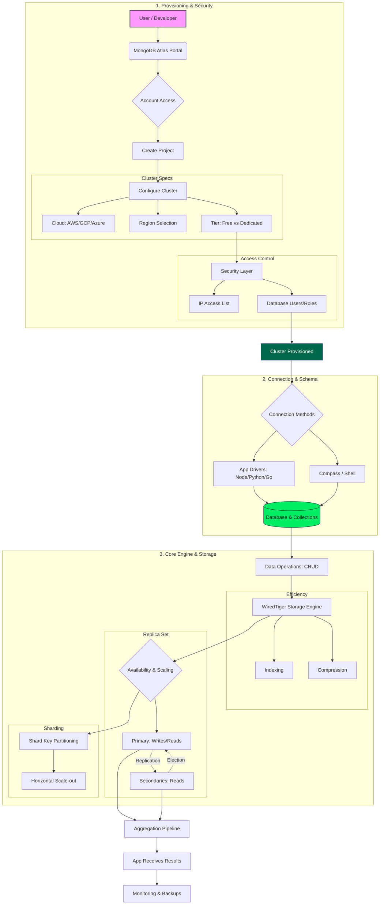

# **Context**

- [**Context**](#context)
- [**Day 26 - MongoDB with Python**](#day-26---mongodb-with-python)
  - [**SQL vs NoSQL**](#sql-vs-nosql)
  - [**MongoDB Diagram**](#mongodb-diagram)
  - [**MongoDB Setup And Operations**](#mongodb-setup-and-operations)
- [**Day 27 - MySQL Using Python**](#day-27---mysql-using-python)
  - [**Setup MySQL**](#setup-mysql)
  - [**MySQL Diagram**](#mysql-diagram)
  - [**MySQL Operations**](#mysql-operations)

# [**Day 26 - MongoDB with Python**](./Day%2026%20-%20MongoDB%20with%20Python/)

## **SQL vs NoSQL**

| Feature      | SQL           | NoSQL               |
| ------------ | ------------- | ------------------- |
| Definition   | Relational DB | Non-relational DB   |
| Schema       | Fixed         | Flexible            |
| Scaling      | Vertical      | Horizontal          |
| Consistency  | Strong        | Eventual            |
| Transactions | ACID          | BASE                |
| Data Type    | Structured    | Semi / Unstructured |

- **SQL (Structured Query Language Databases)**

  - Databases based on the **relational model**
  - Data is stored in **tables with predefined schema**
  - Uses SQL to create, read, update, and delete data
  - Schema is fixed and predefined
  - Relationships supported using joins & foreign keys
  - **Best Use Cases**
    - Financial systems
    - Inventory management
    - Enterprise applications
  - **Examples**
    - MySQL
    - PostgreSQL
    - SQLite
    - Oracle

- **NoSQL (Not Only SQL Databases)**

  - Databases designed for **non-relational or flexible data models**
  - Data is stored in formats like **documents, key-value pairs, columns, or graphs**
  - Optimized for **scalability, performance, and flexible schemas**
  - Key-Value, Document, Column, Graph
  - Semi-structured or unstructured
  - Schema is dynamic / schema-less
  - Relationships managed at application level
  - **Best Use Cases**
    - Big data systems
    - Content management
    - Real-time applications
  - **Examples**
    - MongoDB
    - Redis
    - Cassandra
    - DynamoDB
    - Neo4j

[⬆️ Go to Context](#context)

## **MongoDB Diagram**



- MongoDB Database
  

[⬆️ Go to Context](#context)

## **MongoDB Setup And Operations**

- Connection & Setup
  - Create Project
  - Create Cluster
    - Setup Network access (access from anywhere)
  - Connect cluster
    - Select driver (stable python api)
    - Get connection string code `mongodb+srv://...`
  - Create [venv](../Module%2010%20-%20Virtual%20Environment%20&%20Requirements/)
  - Install [ipykernel](https://pypi.org/project/ipykernel/), [pandas](https://pypi.org/project/pandas/) and [pymongo](https://pypi.org/project/pymongo/)

  ```py
  from pymongo

  client = pymongo.MongoClient(CONNECTION_URL)      # connect
  db = client["db_name"]                    # select database
  collection = db["collection_name"]        # select collection

  client.list_database_names()              # list DBs
  db.list_collection_names()                # list collections
  client.close()                            # close connection
  ```

- Insert Operations

  ```py
  collection.insert_one(document)           # insert single document
  collection.insert_many(documents)          # insert multiple documents
  collection.count_documents({})             # count all documents
  ```

- Read / Fetch Operations

  ```py
  collection.find()                          # fetch all (cursor)
  collection.find_one()                      # fetch single document
  ```

- Limit & pagination

  ```py
  collection.find().limit(10)
  collection.find().skip(10).limit(10)
  ```

- Sample data instead of full collection

  ```py
  df = pd.DataFrame(
      list(collection.find({}, {"_id": 0}).limit(1000))
  )
  ```

> [!NOTE]
>
> - Without projection `df = pd.DataFrame(list(collection.find().limit(1000)))` will returns `_id` also
> - `{}`              → no filter (fetch all documents)
> - `{"_id": 0}`      → projection: exclude MongoDB's _id field
> - `limit(1000)`     → fetch only 1000 documents
> - `list(...)`       → load 1000 docs into memory
> - `DataFrame(...)`  → convert to pandas

- Filtering

  ```py
  collection.find({"field": "value"})
  collection.find({"field": {"$gt": 10}})
  collection.find({"field": {"$gte": 10}})
  collection.find({"field": {"$lt": 10}})
  collection.find({"field": {"$lte": 10}})
  collection.find({"field": {"$ne": "value"}})
  collection.find({"field": {"$in": [1, 2, 3]}})
  collection.find({"field": {"$nin": [1, 2, 3]}})
  ```

- Logical operators

  ```py
  collection.find({"$and": [{"a": 1}, {"b": 2}]})
  collection.find({"$or": [{"a": 1}, {"b": 2}]})
  ```

- Projection (Control Output)

  ```py
  collection.find({}, {"_id": 0})
  collection.find({}, {"field1": 1, "field2": 1})
  collection.find({}, {"field": 0})
  ```

- Sorting

  ```py
  collection.find().sort("field", 1)         # ascending
  collection.find().sort("field", -1)        # descending
  ```

- Update Operations

  ```py
  collection.update_one(
      {"field": "value"},
      {"$set": {"field": "new_value"}}
  )

  collection.update_many(
      {"status": "pending"},
      {"$set": {"status": "processed"}}
  )

  collection.update_one(
      {"field": "value"},
      {"$inc": {"count": 1}}
  )

  collection.update_one(
      {"field": "value"},
      {"$unset": {"temp_field": ""}}
  )

  collection.update_one(
      {"field": "value"},
      {"$rename": {"old_name": "new_name"}}
  )
  ```

- Delete Operations

  ```py
  collection.delete_one({"field": "value"})
  collection.delete_many({"status": "obsolete"})
  collection.drop()                          # drop entire collection
  ```

- Indexing (Performance)

  ```py
  collection.create_index("field")
  collection.create_index([("field1", 1), ("field2", -1)])
  collection.index_information()
  collection.drop_index("index_name")
  ```

- Aggregation Pipeline (Core)

  ```py
  pipeline = [
      {"$match": {"field": "value"}},
      {"$group": {"_id": "$category", "count": {"$sum": 1}}},
      {"$sort": {"count": -1}},
      {"$limit": 5}
  ]

  collection.aggregate(pipeline)
  ```

- Cursor Utilities & Safety

  ```py
  cursor = collection.find().limit(10)
  for doc in cursor:
      print(doc)
  ```

[⬆️ Go to Context](#context)

# [**Day 27 - MySQL Using Python**](./Day%2027%20-%20MySQL%20Using%20Python/)

## **Setup MySQL**

- Download [MySQL Installer (v8.0.44)](https://dev.mysql.com/downloads/installer/)
- Open and install it with all default selected option
- Create [venv](../Module%2010%20-%20Virtual%20Environment%20&%20Requirements/)
- Install [ipykernel](https://pypi.org/project/ipykernel/), [mysql-connector-python](https://pypi.org/project/mysql-connector-python/) and [pandas](https://pypi.org/project/pandas/)

## **MySQL Diagram**


## **MySQL Operations**

- Connection & Setup

  ```py
  import mysql.connector   # or: import pymysql

  conn = mysql.connector.connect(
      host="HOST",
      user="USER",
      password="PASSWORD",
      database="DB_NAME"
  )

  cursor = conn.cursor(dictionary=True)   # dictionary=True → rows as dicts
  conn.is_connected()                      # check connection
  ```

- Create Database

  ```py
  cursor.execute("CREATE DATABASE IF NOT EXISTS db_name")
  cursor.execute("SHOW DATABASES")
  cursor.fetchall()
  ```

- Database & Table Utilities

  ```py
  cursor.execute("SHOW DATABASES")
  cursor.fetchall()

  cursor.execute("SHOW TABLES")
  cursor.fetchall()

  cursor.execute("DESCRIBE table_name")
  cursor.fetchall()
  ```

- Insert Operations

  ```py
  cursor.execute(
      "INSERT INTO table_name (col1, col2) VALUES (%s, %s)",
      (val1, val2)
  )

  cursor.executemany(
      "INSERT INTO table_name (col1, col2) VALUES (%s, %s)",
      data_list
  )

  # Single insert with direct values
  cursor.execute(
      "INSERT INTO StudentDetails VALUES ('1132','Sachin','Kumar','1997-11-11','Eleventh','A')"
  )

  conn.commit()                            # REQUIRED after insert/update/delete
  cursor.rowcount                          # affected rows
  ```

- Insert CSV data to MySQL shown in notebook -> [Day 27 - MySQL Using Python/MySQL.ipynb](./Day%2027%20-%20MySQL%20Using%20Python/MySQL.ipynb)

- Read / Fetch Operations

  ```py
  cursor.execute("SELECT * FROM table_name")
  rows = cursor.fetchall()

  cursor.execute("SELECT * FROM table_name LIMIT 10")
  cursor.fetchall()

  cursor.execute("SELECT * FROM table_name LIMIT 10 OFFSET 10")
  cursor.fetchall()
  ```

- Filtering (WHERE clause)

  ```py
  cursor.execute(
      "SELECT * FROM table_name WHERE status = %s",
      ("Approved",)
  )

  cursor.execute(
      "SELECT * FROM table_name WHERE salary > %s",
      (80000,)
  )

  cursor.execute(
      "SELECT * FROM table_name WHERE year BETWEEN %s AND %s",
      (2020, 2024)
  )
  ```

- Projection (Select columns)

  ```py
  cursor.execute(
      "SELECT col1, col2 FROM table_name"
  )
  cursor.fetchall()
  ```

- Sorting

  ```py
  cursor.execute(
      "SELECT * FROM table_name ORDER BY year ASC"
  )

  cursor.execute(
      "SELECT * FROM table_name ORDER BY salary DESC"
  )
  ```

- Update Operations

  ```py
  cursor.execute(
      "UPDATE table_name SET status = %s WHERE status = %s",
      ("Processed", "Pending")
  )

  cursor.execute(
      "UPDATE table_name SET count = count + 1 WHERE id = %s",
      (1,)
  )

  conn.commit()
  ```

- Delete Operations

  ```py
  # Delete rows from a table
  cursor.execute(
      "DELETE FROM table_name WHERE status = %s",
      ("Obsolete",)
  )

  conn.commit()

  # Delete an entire database by name
  cursor.execute("DROP DATABASE IF EXISTS db_name")
  ```

- Indexing (Performance)

  ```py
  cursor.execute(
      "CREATE INDEX idx_status ON table_name(status)"
  )

  cursor.execute(
      "SHOW INDEX FROM table_name"
  )

  cursor.execute(
      "DROP INDEX idx_status ON table_name"
  )
  ```

- Aggregation / Analytics

  ```py
  cursor.execute(
      """
      SELECT category, COUNT(*) AS count
      FROM table_name
      WHERE status = %s
      GROUP BY category
      ORDER BY count DESC
      LIMIT 5
      """,
      ("Approved",)
  )

  cursor.fetchall()
  ```

- MySQL ↔ pandas Bridge

  ```py
  import pandas as pd

  cursor.execute("SELECT * FROM table_name LIMIT 1000")
  df = pd.DataFrame(cursor.fetchall())
  df.head()
  ```

- Cursor & Connection Safety

  ```py
  cursor.fetchone()        # fetch one row
  cursor.fetchall()        # fetch all rows
  cursor.close()           # close cursor
  conn.close()             # close connection
  ```

[⬆️ Go to Context](#context)
