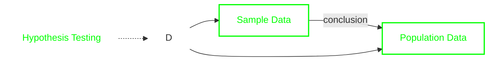

# **Context**

- [**Context**](#context)
- [**Day 35 – Introduction to Statistics**](#day-35--introduction-to-statistics)
  - [**Data**](#data)
    - [Types of Data](#types-of-data)
      - [Qualitative Data](#qualitative-data)
      - [Quantitative Data](#quantitative-data)
    - [Quantitative Data Types](#quantitative-data-types)
      - [Discrete Data](#discrete-data)
      - [Continuous Data](#continuous-data)
  - [**Population**](#population)
  - [**Sample**](#sample)
    - [Why Use a Sample](#why-use-a-sample)
    - [Sampling Techniques](#sampling-techniques)
      - [Probability Sampling](#probability-sampling)
      - [Non-Probability Sampling](#non-probability-sampling)
  - [**Variables**](#variables)
    - [Types of Variables](#types-of-variables)
      - [Qualitative (Categorical) Variables](#qualitative-categorical-variables)
      - [Quantitative (Numerical) Variables](#quantitative-numerical-variables)
  - [**Statistics Types**](#statistics-types)
    - [Descriptive Statistics](#descriptive-statistics)
      - [Measures of Central Tendency](#measures-of-central-tendency)
      - [Measures of Dispersion](#measures-of-dispersion)
      - [Measures of Shape](#measures-of-shape)
      - [Data Visualization in Descriptive Statistics](#data-visualization-in-descriptive-statistics)
    - [Inferential Statistics](#inferential-statistics)
      - [Estimation](#estimation)
      - [Hypothesis Testing](#hypothesis-testing)
      - [Correlation Analysis](#correlation-analysis)
      - [Regression Analysis](#regression-analysis)
    - [Descriptive vs Inferential](#descriptive-vs-inferential)
  - [**When to Use What**](#when-to-use-what)
  - [**Real-Life Use of Statistics**](#real-life-use-of-statistics)
- [**Day 36 - Measure Of Central Tendency Dispersion Percentiles Quartiles**](#day-36---measure-of-central-tendency-dispersion-percentiles-quartiles)
  - [**Measure Of Central Tendency**](#measure-of-central-tendency)
    - [Math on Mean (Population and Sample)](#math-on-mean-population-and-sample)
      - [Population Mean](#population-mean)
      - [Sample Mean](#sample-mean)
      - [Math Problem for Mean](#math-problem-for-mean)
      - [Mean Math Solution (Population)](#mean-math-solution-population)
      - [Mean Math Solution (Sample)](#mean-math-solution-sample)
  - [**Dispersion**](#dispersion)
    - [Math on Variance (Population and Sample)](#math-on-variance-population-and-sample)
      - [Population Variance](#population-variance)
      - [Sample Variance](#sample-variance)
      - [Math Problem for Variance](#math-problem-for-variance)
      - [Variance Math Solution (Population)](#variance-math-solution-population)
      - [Variance Math Solution (Sample)](#variance-math-solution-sample)
    - [Math on Standard Deviation](#math-on-standard-deviation)
      - [Standard Deviation Is The Square Root Of Variance](#standard-deviation-is-the-square-root-of-variance)
      - [1st Standard Deviation](#1st-standard-deviation)
      - [2nd Standard Deviation](#2nd-standard-deviation)
      - [3rd Standard Deviation](#3rd-standard-deviation)
  - [**Percentiles and Quartiles**](#percentiles-and-quartiles)
    - [Percentiles](#percentiles)
    - [Quartiles](#quartiles)
- [**Day 37 - Findings Outliers in Statistics**](#day-37---findings-outliers-in-statistics)
  - [**Outliers in Statistics**](#outliers-in-statistics)
    - [Common Causes](#common-causes)
    - [Detection Using Z-Score](#detection-using-z-score)
    - [Detection Using IQR (Interquartile Range)](#detection-using-iqr-interquartile-range)
    - [Detection Using Box Plot](#detection-using-box-plot)
      - [Five Number Summary](#five-number-summary)
      - [Outliers using Box Plot](#outliers-using-box-plot)
      - [Outlier Fences](#outlier-fences)
- [**Day 38 - Different Plot, Distribution \& Theorem in Statistics**](#day-38---different-plot-distribution--theorem-in-statistics)
  - [**Normal Distribution**](#normal-distribution)
    - [Empirical Rule (68–95–99.7 Rule / 3-Sigma Rule)](#empirical-rule-6895997-rule--3-sigma-rule)
  - [**Central Limit Theorem (CLT)**](#central-limit-theorem-clt)
  - [**Log-Normal Distribution**](#log-normal-distribution)
  - [**Power Law Distribution**](#power-law-distribution)
    - [**Box-Cox Transformation**](#box-cox-transformation)
  - [**Pareto Distribution**](#pareto-distribution)
  - [**Comparison of Distribution**](#comparison-of-distribution)
- [**Day 39 - Statistics Practical Implementation**](#day-39---statistics-practical-implementation)
  - [**Measure of Central Tendency**](#measure-of-central-tendency-1)
    - [Mean](#mean)
    - [Median](#median)
    - [Mode](#mode)
    - [Box Plot (Outlier Detection)](#box-plot-outlier-detection)
  - [**Five Number Summary**](#five-number-summary-1)
  - [**Measure of Dispersion**](#measure-of-dispersion)
    - [Variance](#variance)
    - [Standard Deviation](#standard-deviation)
  - [**Histograms and Probability Density Function (PDF)**](#histograms-and-probability-density-function-pdf)
    - [Using Real Dataset (Iris)](#using-real-dataset-iris)
  - [**Normal Distribution using Python**](#normal-distribution-using-python)
  - [**Other Distributions**](#other-distributions)
    - [Log-Normal Distribution](#log-normal-distribution-1)
    - [Effect of Log Transformation](#effect-of-log-transformation)
  - [**Q–Q Plot (Quantile–Quantile Plot)**](#qq-plot-quantilequantile-plot)
  - [**Features and Target Variables**](#features-and-target-variables)
  - [**Correlation and Pair Plot**](#correlation-and-pair-plot)
- [**Day 40 - Hypothesis Testing, Probability Density, Mass \& Cumulative**](#day-40---hypothesis-testing-probability-density-mass--cumulative)
  - [**Hypothesis Testing Diagram**](#hypothesis-testing-diagram)
  - [**Types of Hypotheses**](#types-of-hypotheses)
  - [**Probability Distributions**](#probability-distributions)
    - [Probability Mass Function (PMF)](#probability-mass-function-pmf)
    - [Probability Density Function (PDF)](#probability-density-function-pdf)
    - [Cumulative Distribution Function (CDF)](#cumulative-distribution-function-cdf)
    - [Probability Distributions Differences](#probability-distributions-differences)
- [**Day 41 - Type 1 And Type 2 Error, Chi Square Test**](#day-41---type-1-and-type-2-error-chi-square-test)
  - [**Type I and Type II Error**](#type-i-and-type-ii-error)
    - [Type I Error (α – False Positive)](#type-i-error-α--false-positive)
    - [Type II Error (β – False Negative)](#type-ii-error-β--false-negative)
    - [Confusion Matrix View](#confusion-matrix-view)
  - [**Chi-Square Test**](#chi-square-test)
    - [Uses of Chi-Square Test](#uses-of-chi-square-test)
    - [Chi-Square Test of Independence](#chi-square-test-of-independence)
    - [Chi-Square Test of Goodness of Fit](#chi-square-test-of-goodness-of-fit)
    - [Chi-Square \& Errors Link](#chi-square--errors-link)

# **Day 35 – Introduction to Statistics**

- Statistics is the science of collecting, organizing, analyzing, and interpreting data
- Helps us make decisions based on data, not guesses

## **Data**

- A piece of information

- Can be numbers, text, images, measurements, etc.

- Examples

  - Age of students
  - Exam marks
  - Temperature readings
  - Number of visitors on a website

[⬆️ Go to Context](#context)

### Types of Data

#### Qualitative Data

- Describes qualities or categories

- Non-numerical

- Examples

  - Gender
  - Color
  - Country
  - Grade (A, B, C)

[⬆️ Go to Context](#context)

#### Quantitative Data

- Numerical data

- Can be measured or counted

- Examples

  - Height
  - Weight
  - Marks
  - Number of pets

[⬆️ Go to Context](#context)

### Quantitative Data Types

#### Discrete Data

- Countable values

- Usually whole numbers

- Examples

  - Number of students
  - Number of cars
  - Number of goals

[⬆️ Go to Context](#context)

#### Continuous Data

- Measurable values

- Can have decimals

- Examples

  - Height
  - Weight
  - Time
  - Temperature

[⬆️ Go to Context](#context)

## **Population**

- Entire group we want information about

- Examples

  - All students in a school
  - All voters in a country

[⬆️ Go to Context](#context)

## **Sample**

- A small part of the population

- Used when population is too large

- Example

  - 100 students selected from a school of 2000

[⬆️ Go to Context](#context)

### Why Use a Sample

- Saves time
- Saves money
- Easier to collect and analyze

[⬆️ Go to Context](#context)

### Sampling Techniques

- Techniques used to select a **sample from a population**
- Divided into **Probability** and **Non-probability** sampling

[⬆️ Go to Context](#context)

#### Probability Sampling

- Every element has a **known, non-zero chance** of selection
- Selection is **random**
- Results are **more accurate and reliable**
- **Less bias** in sample selection
- Suitable for **large populations**
- Supports **statistical inference**
- Requires **more time and cost**

- Types
  - Simple Random Sampling
  - Stratified Random Sampling
  - Cluster Sampling
  - Systematic Sampling
  - Multistage Sampling

- **Simple Random Sampling**
  - Each member has an **equal chance**
  - Uses random selection

    ```py
    import random

    population = list(range(1, 1001))
    sample = random.sample(population, 100)

    print(sample)
    ```

- **Stratified Random Sampling**
  - Population divided into **strata**
  - Random samples taken from each stratum

    ```py
    import random

    male = list(range(1, 501))
    female = list(range(501, 1001))

    sample = random.sample(male, 50) + random.sample(female, 50)
    print(sample)
    ```

- **Cluster Sampling**
  - Population divided into **clusters**
  - Entire clusters are selected randomly

    ```py
    import random

    clusters = {
        "C1": list(range(1, 101)),
        "C2": list(range(101, 201)),
        "C3": list(range(201, 301))
    }

    selected = random.sample(list(clusters.keys()), 2)
    sample = []

    for c in selected:
        sample.extend(clusters[c])

    print(sample)
    ```

- **Systematic Sampling**
  - Selects every **k-th** element
  - Requires ordered data

    ```py
    population = list(range(1, 1001))
    k = 10

    sample = population[::k]
    print(sample)
    ```

- **Multistage Sampling**
  - Sampling done in **multiple steps**
  - Combination of sampling methods

    ```py
    import random

    districts = {
        "D1": {"S1": list(range(1, 51)), "S2": list(range(51, 101))},
        "D2": {"S3": list(range(101, 151)), "S4": list(range(151, 201))}
    }

    selected_district = random.choice(list(districts.keys()))
    selected_school = random.choice(list(districts[selected_district].keys()))
    sample = random.sample(districts[selected_district][selected_school], 20)

    print(sample)
    ```

[⬆️ Go to Context](#context)

#### Non-Probability Sampling

- Selection is **not random**
- Chance of selection is **unknown**
- Results may be **biased**
- **Faster and cheaper** than probability sampling
- Useful when population is **hard to reach**
- Does **not support strong generalization**
- Suitable for **exploratory research**

- Types
  - Quota Sampling
  - Snowball Sampling
  - Judgment (Purposive) Sampling
  - Convenience Sampling

- **Quota Sampling**
  - Sample selected to meet **fixed quotas**

  ```py
  boys = ["B1", "B2", "B3", "B4"]
  girls = ["G1", "G2", "G3", "G4"]

  sample = boys[:2] + girls[:2]
  print(sample)
  ```

- **Snowball Sampling**
  - Existing participants **refer new participants**
  - Used for hard-to-reach populations

    ```py
    initial = ["A"]
    referrals = {
        "A": ["B", "C"],
        "B": ["D"],
        "C": ["E"]
    }

    sample = initial + referrals["A"] + referrals["B"]
    print(sample)
    ```

- **Judgment (Purposive) Sampling**
  - Selected based on **researcher’s judgment**

    ```py
    students = {
        "S1": 92,
        "S2": 85,
        "S3": 95,
        "S4": 70
    }

    sample = [s for s, m in students.items() if m > 90]
    print(sample)
    ```

- **Convenience Sampling**
  - Sample chosen based on **availability**

    ```py
    population = list(range(1, 1001))
    sample = population[:50]

    print(sample)
    ```

[⬆️ Go to Context](#context)

## **Variables**

- A **variable** is a characteristic or attribute that can **change or vary**
- It represents the **data values** collected in a study
- Can take **different values** for different individuals or observations

[⬆️ Go to Context](#context)

### Types of Variables

- Qualitative (Categorical) Variables
- Quantitative (Numerical) Variables

[⬆️ Go to Context](#context)

#### Qualitative (Categorical) Variables

- Describe **qualities or categories**
- Do **not** involve numerical measurement
- Types
  - Nominal Variables
  - Ordinal Variables

- **Nominal Variables**
  - Categories with **no specific order**
  - Examples
    - Gender
    - Blood group
    - Eye color

- **Ordinal Variables**
  - Categories with a **logical order**
  - Difference between categories is **not measurable**
  - Examples

    - Education level (Primary, Secondary, Higher)
    - Satisfaction level (Low, Medium, High)

[⬆️ Go to Context](#context)

#### Quantitative (Numerical) Variables

- Represent **numbers**
- Values can be **measured or counted**
- Types
  - Discrete Variables
  - Continuous Variables

- **Discrete Variables**
  - Countable values
  - Usually whole numbers
  - Examples
    - Number of students in a class
    - Number of cars in a parking lot

- **Continuous Variables**
  - Can take **any value within a range**
  - Can include decimals
  - Examples
    - Height
    - Weight
    - Time

- **Independent Variable**
  - Variable that is **manipulated or controlled**
  - Causes change in another variable
  - Example
    - Study hours

- **Dependent Variable**
  - Variable that **responds** to changes
  - Outcome being measured
  - Example
    - Exam score

- **Control Variable**
  - Variables kept **constant**
  - Prevents external influence on results
  - Example
    - Same classroom environment

[⬆️ Go to Context](#context)

## **Statistics Types**

### Descriptive Statistics

- Descriptive statistics is the branch of statistics that **summarizes and describes data**
- It consists of organizing and summarizing of data
- It helps us **understand patterns, trends, and distributions**
- It does **not** make predictions or generalizations beyond the data

  - Mean
  - Median
  - Mode
  - Range
  - Charts (bar, histogram, pie)

- Example

  - Average score of a class is **75**
  - Highest temperature this week was **34°C**

  ```py
  import numpy as np

  data = [60, 70, 80, 90]
  print("Mean:", np.mean(data))
  print("Max:", max(data))
  ```

- Purpose of Descriptive Statistics

  - Simplify large datasets
  - Present data in a meaningful way
  - Identify patterns and outliers
  - Support decision-making and further analysis

- Types of Descriptive Statistics

  - Measures of Central Tendency
  - Measures of Dispersion
  - Measures of Shape
  - Data Visualization

[⬆️ Go to Context](#context)

#### Measures of Central Tendency

- Describe the **center** or typical value of data
- Commonly used to represent data with a single value

---

- Mean (Average)

  - Sum of all values divided by number of values
  - Sensitive to extreme values (outliers)

- **Formula**

- $$Mean = (Sum of values) / (Number of values)$$

  ```py
  import numpy as np

  data = [10, 20, 30, 40, 50]
  mean = np.mean(data)
  print(mean)
  ```

- Median

  - The **middle value** when data is sorted
  - Less affected by outliers

    ```py
    import numpy as np

    data = [10, 20, 100, 30, 40]
    median = np.median(data)
    print(median)
    ```

- Mode

  - The value that **appears most frequently**
  - Can have more than one mode

    ```py
    from statistics import mode

    data = [1, 2, 2, 3, 4]
    print(mode(data))
    ```

[⬆️ Go to Context](#context)

#### Measures of Dispersion

- Describe how **spread out** the data is
- Show variability in data

---

- Range

  - Difference between maximum and minimum values

    ```py
    data = [5, 10, 15, 20]
    range_value = max(data) - min(data)
    print(range_value)
    ```

- Variance

  - Average of squared differences from the mean
  - Shows how far values deviate from the mean

  ```py
  import numpy as np

  data = [10, 20, 30, 40]
  variance = np.var(data)
  print(variance)
  ```

- Standard Deviation

  - Square root of variance
  - Shows dispersion in the same unit as data

  ```py
  import numpy as np

  data = [10, 20, 30, 40]
  std_dev = np.std(data)
  print(std_dev)
  ```

- Bell Curve (Normal Distribution)

  - Graphical representation of data dispersion
  - Most values cluster around the **mean**
  - Standard deviation controls the **width of the bell**

  ```py
  import numpy as np
  import matplotlib.pyplot as plt
  from scipy.stats import norm

  mean = 50
  std_dev = 10
  x = np.linspace(20, 80, 1000)
  y = norm.pdf(x, mean, std_dev)

  plt.plot(x, y)
  plt.title("Bell Curve Showing Dispersion")
  plt.xlabel("Values")
  plt.ylabel("Probability Density")
  plt.show()
  ```

[⬆️ Go to Context](#context)

#### Measures of Shape

- Describe the **distribution shape** of data

---

- Skewness

  - Measures data asymmetry
  - Positive skew → tail on the right
  - Negative skew → tail on the left

  ```py
  from scipy.stats import skew

  data = [1, 2, 3, 4, 10]
  print(skew(data))
  ```

- Kurtosis

  - Measures how peaked or flat the distribution is
  - High kurtosis → sharp peak
  - Low kurtosis → flat distribution

  ```py
  from scipy.stats import kurtosis

  data = [1, 2, 3, 4, 10]
  print(kurtosis(data))
  ```

[⬆️ Go to Context](#context)

#### Data Visualization in Descriptive Statistics

- Helps visually understand data
- Makes patterns easier to identify

- Common Visualization Methods

  - Histogram
  - Bar chart
  - Box plot
  - Pie chart

- **Histogram**

  - Shows the **distribution of numerical data**
  - Useful to understand **frequency and spread**

  ```py
  import matplotlib.pyplot as plt

  data = [10, 20, 20, 30, 30, 30, 40]

  plt.hist(data)
  plt.xlabel("Values")
  plt.ylabel("Frequency")
  plt.show()
  ```

- **Bar Chart**

  - Used to **compare values across categories**
  - Each bar represents a **category**

  ```py
  import matplotlib.pyplot as plt

  categories = ["A", "B", "C", "D"]
  values = [10, 25, 15, 30]

  plt.bar(categories, values)
  plt.xlabel("Categories")
  plt.ylabel("Values")
  plt.show()
  ```

- **Box Plot**

  - Shows **data spread, median, and outliers**
  - Helpful for **comparing distributions**

  ```py
  import matplotlib.pyplot as plt

  data = [10, 20, 30, 40, 50]

  plt.boxplot(data)
  plt.show()
  ```

- **Pie Chart**

  - Displays **proportions of a whole**
  - Best when total equals **100%**

  ```py
  import matplotlib.pyplot as plt

  labels = ["Python", "Java", "C++", "JavaScript"]
  sizes = [40, 25, 20, 15]

  plt.pie(sizes, labels=labels, autopct="%1.1f%%")
  plt.show()
  ```

[⬆️ Go to Context](#context)

### Inferential Statistics

- Inferential statistics is the branch of statistics that **draws conclusions about a population using sample data**
- Uses sample data to make conclusions about population
- It helps make **predictions, estimates, and decisions**
- Uses **probability theory**

- Common tools
  - Predictions
  - Estimations
  - Hypothesis testing
  - Confidence intervals
  - Regression analysis

- Results are expressed with **confidence levels and margins of error**

  - Hypothesis testing
  - Confidence intervals
  - Probability distributions
  - Regression & correlation

- Example

  - Predicting **average income** of a country using a sample
  - Testing whether a **new medicine works better** than an old one

    ```py
    import numpy as np

    sample = [68, 70, 72, 74, 76]
    print("Sample Mean:", np.mean(sample))
    ```

- Example

  - From 100 voters, predict election result
  - From sample students, estimate average marks of whole school

    ```py
    import numpy as np

    sample = [72, 75, 78, 80, 74]
    population_mean_estimate = np.mean(sample)
    print("Estimated population mean:", population_mean_estimate)
    ```

- Purpose of Inferential Statistics
  - Make predictions about a population
  - Test assumptions or claims
  - Measure uncertainty
  - Support data-driven decisions

- Types of Inferential Statistics
  - Estimation
  - Hypothesis Testing
  - Correlation Analysis
  - Regression Analysis

[⬆️ Go to Context](#context)

#### Estimation

- **Purpose of Estimation**
  - Use **sample data** to estimate **unknown population parameters**
  - Quantify uncertainty in estimates

- **Population vs Sample** *(Foundation for Estimation)*

  - **Population**
    - Entire group of interest
    - Parameters are usually **unknown**

  - **Sample**
    - Subset taken from the population
    - Used to compute **estimates**

      ```py
      population = list(range(1, 1001))
      sample = population[:50]
      print(len(sample))
      ```

- **Probability** *(Tool used in Estimation)*
  - Measures how likely an event is to occur
  - Describes **randomness and uncertainty**
  - Helps quantify **how reliable an estimate is**
  - Values range from **0 to 1**

  - Formula
  - $$Probability = (Favorable Outcomes) / (Total Outcomes)$$

    ```py
    favorable = 1
    total = 6
    print(favorable / total)
    ```

- **Point Estimation**
  - Single numerical value used to estimate a population parameter
  - Common point estimates:
    - Sample mean → population mean
    - Sample proportion → population proportion

      ```py
      import numpy as np

      data = [50, 52, 53, 51, 54]
      print(np.mean(data))
      ```

- **Confidence Interval**
  - Interval estimate of a population parameter
  - Range of values likely to contain the **true population parameter**
  - Provides a **range** rather than a single value
  - Expressed with a **confidence level (e.g., 95%)**

    ```py
    import numpy as np
    from scipy import stats

    data = [50, 52, 53, 51, 54]
    mean = np.mean(data)
    ci = stats.sem(data) * stats.t.ppf((1 + 0.95) / 2, len(data)-1)
    print(mean - ci, mean + ci)
    ```

- Population vs Sample → **foundation**
- Probability → **supporting tool**
- Point Estimation + Confidence Interval → **actual estimation**

[⬆️ Go to Context](#context)

#### Hypothesis Testing

- Hypothesis testing is a form of statistical inference that uses data from a sample to draw conclusions about a population parameter or a population probability distribution
- Used to test a claim about a population
- Two hypotheses:
  - **Null hypothesis (H₀)** → no effect
  - **Alternative hypothesis (H₁)** → effect exists

- **Steps of Hypothesis Testing**
  - State hypotheses
  - Choose significance level (α)
  - Perform statistical test
  - Make a decision

- **Z Test**

  - Tests population mean when variance is known or sample size is large
  - Based on normal distribution
  - [z-table](https://z-table.com/)

    ```py
    import numpy as np
    from statsmodels.stats.weightstats import ztest

    data = np.array([52, 55, 50, 53, 54])
    z_stat, p_value = ztest(data, value=50)
    print("p-value:", p_value)
    ```

- **F Test**

  - Compares variances of two samples
  - Used as a basis for ANOVA

    ```py
    import numpy as np

    data1 = [10, 12, 14, 16]
    data2 = [8, 9, 11, 13]

    f_stat = np.var(data1, ddof=1) / np.var(data2, ddof=1)
    print("F statistic:", f_stat)
    ```

- **t-Test**

  - Compares the means of a sample with a known value
  - Commonly used for small samples

    ```py
    from scipy.stats import ttest_1samp

    data = [68, 70, 72, 74, 76]
    t_stat, p_value = ttest_1samp(data, 70)
    print("p-value:", p_value)
    ```

- **ANOVA Test**

  - Compares means of more than two groups
  - Determines if at least one group differs significantly

    ```py
    from scipy.stats import f_oneway

    g1 = [10, 12, 14]
    g2 = [20, 22, 24]
    g3 = [30, 32, 34]

    f_stat, p_value = f_oneway(g1, g2, g3)
    print("p-value:", p_value)
    ```

- **Wilcoxon Signed Rank Test**

  - Non-parametric alternative to paired t-test
  - Used when data is not normally distributed

    ```py
    from scipy.stats import wilcoxon

    before = [10, 12, 14, 16]
    after = [11, 13, 15, 17]

    stat, p_value = wilcoxon(before, after)
    print("p-value:", p_value)
    ```

- **Mann-Whitney U Test**

  - Non-parametric alternative to independent t-test
  - Compares two independent groups

    ```py
    from scipy.stats import mannwhitneyu

    group1 = [10, 12, 14]
    group2 = [20, 22, 24]

    stat, p_value = mannwhitneyu(group1, group2)
    print("p-value:", p_value)
    ```

[⬆️ Go to Context](#context)

#### Correlation Analysis

- Measures **relationship strength** between variables
- Value ranges from **-1 to +1**

  ```py
  import numpy as np

  x = [1, 2, 3, 4, 5]
  y = [2, 4, 6, 8, 10]

  corr = np.corrcoef(x, y)
  print(corr)
  ```

[⬆️ Go to Context](#context)

#### Regression Analysis

- Examines how one variable **predicts another**
- Commonly used for forecasting

- **Linear Regression**

  - Predicts a continuous dependent variable
  - Assumes linear relationship

    ```py
    from sklearn.linear_model import LinearRegression
    import numpy as np

    X = np.array([1, 2, 3, 4]).reshape(-1, 1)
    y = [2, 4, 6, 8]

    model = LinearRegression()
    model.fit(X, y)
    print(model.predict([[5]]))
    ```

- **Nominal Regression**

  - Used when dependent variable has unordered categories
  - Multiclass classification problem

    ```py
    import statsmodels.api as sm

    X = sm.add_constant([[1], [2], [3], [4]])
    y = [0, 1, 2, 1]

    model = sm.MNLogit(y, X)
    result = model.fit()
    print(result.summary())
    ```

- **Logistic Regression**

  - Used for binary outcomes
  - Outputs probability between 0 and 1

    ```py
    from sklearn.linear_model import LogisticRegression

    X = [[1], [2], [3], [4]]
    y = [0, 0, 1, 1]

    model = LogisticRegression()
    model.fit(X, y)
    print(model.predict([[2.5]]))
    ```

- **Ordinal Regression**

  - Used when dependent variable is ordered
  - Categories have a meaningful order

    ```py
    from statsmodels.miscmodels.ordinal_model import OrderedModel

    X = [[1], [2], [3], [4]]
    y = [1, 2, 2, 3]

    model = OrderedModel(y, X, distr='logit')
    result = model.fit(method='bfgs')
    print(result.summary())
    ```

[⬆️ Go to Context](#context)

### Descriptive vs Inferential

- Descriptive → **summarizes data**
- Inferential → **predicts and concludes**
- Descriptive → no uncertainty
- Inferential → includes uncertainty

- **Descriptive**

  - Describes what happened
  - Uses full dataset
  - No uncertainty

- **Inferential**

  - Predicts or generalizes
  - Uses sample
  - Includes uncertainty

[⬆️ Go to Context](#context)

## **When to Use What**

- Use **Descriptive**

  - To summarize data
  - To visualize information

- Use **Inferential**

  - To make decisions
  - To predict future or unseen data

[⬆️ Go to Context](#context)

## **Real-Life Use of Statistics**

- Business decisions
- Medical research
- Sports analysis
- Machine learning & AI
- Government surveys

[⬆️ Go to Context](#context)

# **Day 36 - Measure Of Central Tendency Dispersion Percentiles Quartiles**

## **Measure Of Central Tendency**

- [Measure Of Central Tendency](#measures-of-central-tendency)

### Math on Mean (Population and Sample)

#### Population Mean

- In statistics, the **population mean** is the average of **all values** in the population.
- Formula (Population Mean)

```math
\mu = \frac{\sum_{i=1}^{N} x_i}{N}
```

- Here
  - $( \mu )$ = population mean
  - $( x_i )$ = each value in the population
  - $( N )$ = total number of population elements

[⬆️ Go to Context](#context)

#### Sample Mean

- The **sample mean** is the average of **some values** taken from the population.
- Formula (Sample Mean)

```math
\bar{x} = \frac{\sum_{i=1}^{n} x_i}{n}
```

- Here
  - $( \bar{x} )$ = sample mean
  - $( x_i )$ = each value in the sample
  - $( n )$ = sample size

[⬆️ Go to Context](#context)

#### Math Problem for Mean

- Suppose the marks of **5 students** are:

```math
10,\ 20,\ 30,\ 40,\ 50
```

- Case 1: Treat as **Population**
- Here:
  - Total values $( N = 5 )$

[⬆️ Go to Context](#context)

#### Mean Math Solution (Population)

```math
\mu = \frac{10 + 20 + 30 + 40 + 50}{5}
```

```math
\mu = \frac{150}{5} = 30
```

> **Population mean = 30**

- Case 2: Treat as Sample
- Same values, but assume they are a **sample**.
- Here:
  - Sample size $( n = 5 )$

[⬆️ Go to Context](#context)

#### Mean Math Solution (Sample)

```math
\bar{x} = \frac{10 + 20 + 30 + 40 + 50}{5}
```

```math
\bar{x} = \frac{150}{5} = 30
```

> **Sample mean = 30**

[⬆️ Go to Context](#context)

## **Dispersion**

- [Measure Of Dispersion](#measures-of-dispersion)

[⬆️ Go to Context](#context)

### Math on Variance (Population and Sample)

#### Population Variance

- **Population variance** measures how much the **entire population** deviates from the population mean.

- Formula (Population Variance)

```math
\sigma^2 = \frac{\sum_{i=1}^{N} (x_i - \mu)^2}{N}
```

- Here
  - $( \sigma^2 )$ = population variance
  - $( x_i )$ = each value in the population
  - $( \mu )$ = population mean
  - $( N )$ = population size

[⬆️ Go to Context](#context)

#### Sample Variance

- **Sample variance** measures how much the **sample data** deviates from the sample mean.

  > Notice we divide by $( n-1 )$ (degrees of freedom) instead of $( n )$.

- Formula (Sample Variance)

```math
s^2 = \frac{\sum_{i=1}^{n} (x_i - \bar{x})^2}{n-1}
```

- Here
  - $( s^2 )$ = sample variance
  - $( x_i )$ = each value in the sample
  - $( \bar{x} )$ = sample mean
  - $( n )$ = sample size

[⬆️ Go to Context](#context)

#### Math Problem for Variance

- Marks of 5 students:

```math
10, 20, 30, 40, 50
```

[⬆️ Go to Context](#context)

#### Variance Math Solution (Population)

- Population mean:

```math
\mu = \frac{10+20+30+40+50}{5} = 30
```

- Deviations squared:

```math
(10-30)^2 = 400
(20-30)^2 = 100
(30-30)^2 = 0
(40-30)^2 = 100
(50-30)^2 = 400
```

- Population variance:

```math
\sigma^2 = \frac{400+100+0+100+400}{5} = \frac{1000}{5} = 200
```

> Population variance = **200**

[⬆️ Go to Context](#context)

#### Variance Math Solution (Sample)

- Sample mean:

```math
\bar{x} = 30
```

- Deviations squared = same as above

- Sample variance:

```math
s^2 = \frac{400+100+0+100+400}{5-1} = \frac{1000}{4} = 250
```

> Sample variance = **250**

[⬆️ Go to Context](#context)

### Math on Standard Deviation

- Formulas
  - **Population Standard Deviation:**

  ```math
  \sigma = \sqrt{\sigma^2}
  ```

  - **Sample Standard Deviation:**

  ```math
  s = \sqrt{s^2}
  ```

[⬆️ Go to Context](#context)

#### Standard Deviation Is The Square Root Of Variance

- Population variance: $( \sigma^2 = 200 )$

```math
\sigma = \sqrt{200} \approx 14.14
```

- Sample variance: $( s^2 = 250 )$

```math
s = \sqrt{250} \approx 15.81
```

- So
  - **Population SD ≈ 14.14**
  - **Sample SD ≈ 15.81**

> [!NOTE]
>
> - **Variance** measures the **average squared deviation** from the mean.
> - **Standard deviation** is the **square root of variance**, bringing the measure **back to the same unit as the data**.
> - Always check whether you are working with **population** ((N)) or **sample** ((n-1))—this affects both variance and standard deviation.
> - **Sample SD is usually slightly larger than population SD** for the same data, because it corrects for estimating from a subset.

[⬆️ Go to Context](#context)

#### 1st Standard Deviation

> $(( \mu \pm 1\sigma ))$

Let’s denote:

- $( \mu )$ = mean
- $( \sigma )$ = standard deviation

- Range:

```math
\mu - \sigma \quad \text{to} \quad \mu + \sigma
```

- Contains approximately **68% of data** (for normal distribution)
- Example (from previous population data):

```math
\mu = 30, \quad \sigma \approx 14.14
```

```math
30 - 14.14 \approx 15.86
30 + 14.14 \approx 44.14
```

> **1st SD range: 15.86 → 44.14**

[⬆️ Go to Context](#context)

#### 2nd Standard Deviation

> $(( \mu \pm 2\sigma ))$

- Range:

```math
\mu - 2\sigma \quad \text{to} \quad \mu + 2\sigma
```

- Contains approximately **95% of data**
- Example:

```math
30 - 2(14.14) \approx 1.72
30 + 2(14.14) \approx 58.28
```

> **2nd SD range: 1.72 → 58.28**

[⬆️ Go to Context](#context)

#### 3rd Standard Deviation

> $(( \mu \pm 3\sigma ))$

- Range:

```math
\mu - 3\sigma \quad \text{to} \quad \mu + 3\sigma
```

- Contains approximately **99.7% of data**
- Example:

```math
30 - 3(14.14) \approx -12.42
30 + 3(14.14) \approx 72.42
```

> **3rd SD range: -12.42 → 72.42**

---

> [!NOTE]
>
> - **1 SD** → ~68% of data
> - **2 SD** → ~95% of data
> - **3 SD** → ~99.7% of data
> - Values **outside 3 SD** are considered **rare/outliers**

[⬆️ Go to Context](#context)

## **Percentiles and Quartiles**

```py
import numpy as np

# Sample data
data = [10, 20, 30, 40, 50]

# Percentiles
p40 = np.percentile(data, 40)  # 40th percentile
p90 = np.percentile(data, 90)  # 90th percentile

print(f"40th Percentile: {p40}")
print(f"90th Percentile: {p90}")

# Quartiles
q1 = np.percentile(data, 25)   # 1st Quartile
q2 = np.percentile(data, 50)   # Median / 2nd Quartile
q3 = np.percentile(data, 75)   # 3rd Quartile

print(f"Q1: {q1}, Q2 (Median): {q2}, Q3: {q3}")

# Interquartile Range (IQR)
iqr = q3 - q1
print(f"IQR: {iqr}")
```

- **Output**

  ```sh
  40th Percentile: 24.0
  90th Percentile: 46.0
  Q1: 15.0, Q2 (Median): 30.0, Q3: 45.0
  IQR: 30.0
  ```

### Percentiles

- A **percentile** indicates the **relative position of a value** in a dataset.
- The **k-th percentile (Pk)** is the value below which **k% of the data falls**.

- Formula (for position in sorted data)

```math
L = \frac{k}{100} (n + 1)
```

- Here
  - $( L )$ = position of the k-th percentile in **ordered data**
  - $( k )$ = desired percentile (e.g., 25, 50, 90)
  - $( n )$ = number of data points

- Example

  - Data (sorted):

  ```math
  10, 20, 30, 40, 50
  ```

  - Find the **40th percentile (P40)**

  ```math
  L = \frac{40}{100} (5 + 1) = 0.4 * 6 = 2.4
  ```

  - Position 2.4 → between 2nd (20) and 3rd (30) value
  - Interpolation:

  ```math
  P40 = 20 + 0.4 * (30 - 20) = 20 + 4 = 24
  ```

  > **40th percentile = 24**

[⬆️ Go to Context](#context)

### Quartiles

- **Quartiles** divide data into **4 equal parts**.
- There are **3 quartiles**:

  | Quartile | Description                               |
  | -------- | ----------------------------------------- |
  | Q1       | 25% of data below (1st quartile)          |
  | Q2       | 50% of data below (median / 2nd quartile) |
  | Q3       | 75% of data below (3rd quartile)          |

- Formula (Approximate Position)

```math
Q1 = \frac{1(n+1)}{4}, \quad Q2 = \frac{2(n+1)}{4}, \quad Q3 = \frac{3(n+1)}{4}
```

- $( n )$ = total number of data points

- Example (same data)

  - Data:

  ```math
  10, 20, 30, 40, 50
  ```

  - Q1 position:

  ```math
  L = (1*(5+1))/4 = 6/4 = 1.5
  ```

  - Q1 = between 1st (10) and 2nd (20) value

  ```math
  Q1 = 10 + 0.5*(20-10) = 15
  ```

  - Q2 (median):

  ```math
  L = 2*(5+1)/4 = 12/4 = 3 → 3rd value = 30
  ```

  - Q3:

  ```math
  L = 3*(5+1)/4 = 18/4 = 4.5
  Q3 = 40 + 0.5*(50-40) = 45
  ```

  > Quartiles: **Q1=15, Q2=30, Q3=45**

> [!NOTE]
>
> - **Percentiles**: any percentage of data below a point
> - **Quartiles**: special percentiles (Q1=25th, Q2=50th, Q3=75th)
> - Quartiles are used to calculate **Interquartile Range (IQR = Q3 - Q1)**, useful for **dispersion and outlier detection**

[⬆️ Go to Context](#context)

# [**Day 37 - Findings Outliers in Statistics**](./Day%2037%20-%20Findings%20Outliers%20in%20Statistics/)

## **Outliers in Statistics**

- An **outlier** is a data point that is **significantly different** from other observations in a dataset.
- Outliers can be **much higher or lower** than most of the data.
- They can affect **mean, variance, standard deviation**, and analysis results.

- We use these method to identify outlier
  - **Z-Score Method**
    - Best for **normally distributed data**
    - Identifies points that are **many standard deviations away from the mean**

  - **IQR (Interquartile Range) Method**
    - Non-parametric → works for **skewed distributions**
    - Detects points **outside [Q1 − 1.5×IQR, Q3 + 1.5×IQR]**

  - **Box Plot (Visual Method)**
    - Uses the **IQR internally** but shows a **graphical representation**
    - Quickly identifies **outliers visually**

> [!NOTE]
>
> - There are other advanced techniques for big data or multivariate datasets for outliers:
> - **DBSCAN clustering** (density-based)
> - **Mahalanobis distance** (multivariate outlier detection)
> - **Isolation Forest / LOF** (machine learning methods)
> - For **most practical datasets**, Z-score, IQR, and box plot are sufficient.

[⬆️ Go to Context](#context)

### Common Causes

- Measurement errors
- Data entry mistakes
- Natural variability in the population

[⬆️ Go to Context](#context)

### Detection Using Z-Score

- **Z-score** measures how many **standard deviations** a value is from the mean.

- Formula

```math
Z = \frac{X - \mu}{\sigma}  \quad \text{(Population SD)}
Z = \frac{X - \bar{x}}{s}   \quad \text{(Sample SD)}
```

- Usually, **|Z| > 3** indicates an outlier.

- Z-Score Method

  ```py
  import numpy as np
  from scipy import stats

  # Sample data
  data = [10, 12, 12, 13, 12, 100]

  # Calculate Z-scores
  z_scores = np.abs(stats.zscore(data))  # absolute value
  outliers = np.where(z_scores > 3)

  print("Z-scores:", z_scores)
  print("Outlier indices:", outliers[0])
  print("Outlier values:", np.array(data)[outliers])
  ```

- **Output**

  ```sh
  Z-scores: [0.4, 0.1, 0.1, 0.2, 0.1, 3.0]
  Outlier indices: [5]
  Outlier values: [100]
  ```

[⬆️ Go to Context](#context)

### Detection Using IQR (Interquartile Range)

- Compute Q1, Q3, and IQR

```math
IQR = Q3 - Q1
Lower\ Bound = Q1 - 1.5*IQR
Upper\ Bound = Q3 + 1.5*IQR
```

- Any value **outside [Lower Bound, Upper Bound]** is an outlier.

- IQR Method

  ```py
  # Using the same data
  q1 = np.percentile(data, 25)
  q3 = np.percentile(data, 75)
  iqr = q3 - q1

  lower_bound = q1 - 1.5 * iqr
  upper_bound = q3 + 1.5 * iqr

  outliers_iqr = [x for x in data if x < lower_bound or x > upper_bound]

  print("Lower Bound:", lower_bound)
  print("Upper Bound:", upper_bound)
  print("Outliers using IQR method:", outliers_iqr)
  ```

- **Output**

  ```sh
  Lower Bound: 7.0
  Upper Bound: 28.0
  Outliers using IQR method: [100]
  ```

[⬆️ Go to Context](#context)

### Detection Using Box Plot

#### Five Number Summary

- The **Five-Number Summary** summarizes a dataset using **five key values**:

  | Number  | Description                       |
  | ------- | --------------------------------- |
  | Minimum | Smallest value in the dataset     |
  | Q1      | First quartile (25th percentile)  |
  | Median  | Second quartile (50th percentile) |
  | Q3      | Third quartile (75th percentile)  |
  | Maximum | Largest value in the dataset      |

- It gives a **quick view of the distribution** and helps detect **outliers**.

- Example
- Data (sorted):

  ```text
  10, 12, 12, 13, 12, 100
  ```

1. **Minimum** = 10
2. **Q1 (25th percentile)** = 12
3. **Median (Q2, 50th percentile)** = 12.5
4. **Q3 (75th percentile)** = 13
5. **Maximum** = 100

> - Five-number summary = **[10, 12, 12.5, 13, 100]**
>
> - **100 is an outlier** (far from Q3).

  ```py
  import numpy as np

  # Sample data
  data = [10, 12, 12, 13, 12, 100]

  # Five-number summary
  minimum = np.min(data)
  q1 = np.percentile(data, 25)
  median = np.median(data)
  q3 = np.percentile(data, 75)
  maximum = np.max(data)

  print("Five-number summary:", [minimum, q1, median, q3, maximum])
  ```

- **Output**

  ```text
  Five-number summary: [10, 12.0, 12.5, 13.0, 100]
  ```

---

> [!NOTE]
>
> - **Used in box plots**: the box = Q1 → Q3, line = median, whiskers = min/max (or within 1.5×IQR), outliers beyond whiskers.
> - Helps **quickly understand spread, central tendency, and skewness**.
> - Works well with **small or large datasets**.

#### Outliers using Box Plot

- **Box plots** visually represent data using (five numebr summary):

  - **Minimum**
  - **Q1 (25th percentile)**
  - **Median (Q2)**
  - **Q3 (75th percentile)**
  - **Maximum**
    - **Outliers** as points outside whiskers

- Outliers are typically defined as points **below Q1 - 1.5 × IQR** or **above Q3 + 1.5 × IQR**.

- Python Example

  ```py
  import matplotlib.pyplot as plt

  # Sample data
  data = [10, 12, 12, 13, 12, 100]

  # Create box plot
  plt.boxplot(data, vert=True, patch_artist=True, showmeans=True)
  plt.title("Box Plot Example")
  plt.ylabel("Values")
  plt.show()
  ```

- **Output:**

  - Box represents Q1 to Q3
  - Line inside box = median
  - Whiskers extend to min/max within 1.5×IQR
  - Points outside whiskers = outliers (100 in this case)

---

> [!NOTE]
>
> - Z-score method is best for **normally distributed data**.
> - IQR method is **non-parametric**, works for skewed distributions.
> - Always **investigate outliers** before removing them—they can be **real insights or errors**.

[⬆️ Go to Context](#context)

#### Outlier Fences

- **Fences** define the **cutoff points** beyond which a data point is considered an **outlier**.
- Calculated using the **Interquartile Range (IQR = Q3 − Q1)**.

- Formulas

```math
Lower\ Fence = Q1 - 1.5 \times IQR
```

```math
Upper\ Fence = Q3 + 1.5 \times IQR
```

- Here
  - Q1 = 25th percentile
  - Q3 = 75th percentile
  - IQR = Q3 − Q1

> Any data point **below the lower fence** or **above the upper fence** is an **outlier**.

- Example

- Data (sorted):

  ```text
  10, 12, 12, 13, 12, 100
  ```

- Compute quartiles:

  ```text
  Q1 = 12, Q3 = 13
  IQR = Q3 - Q1 = 13 - 12 = 1
  ```

- Compute fences:

```math
Lower\ Fence = 12 - 1.5 * 1 = 12 - 1.5 = 10.5
Upper\ Fence = 13 + 1.5 * 1 = 13 + 1.5 = 14.5
```

- Detect outliers:

  ```text
  Values < 10.5 → outlier
  Values > 14.5 → outlier
  ```

> In this dataset, **100 > 14.5**, so **100 is an outlier**.

```py
import numpy as np

data = [10, 12, 12, 13, 12, 100]

# Quartiles
q1 = np.percentile(data, 25)
q3 = np.percentile(data, 75)
iqr = q3 - q1

# Fences
lower_fence = q1 - 1.5 * iqr
upper_fence = q3 + 1.5 * iqr

# Detect outliers
outliers = [x for x in data if x < lower_fence or x > upper_fence]

print("Lower Fence:", lower_fence)
print("Upper Fence:", upper_fence)
print("Outliers:", outliers)
```

- **Output:**

  ```sh
  Lower Fence: 10.5
  Upper Fence: 14.5
  Outliers: [100]
  ```

> [!NOTE]
>
> - Fences are **based on IQR**, so they are robust to skewed data.
> - Box plots **automatically use fences** to show whiskers and outliers visually.
> - Can be adjusted: sometimes **2×IQR or 3×IQR** is used for stricter outlier detection.

[⬆️ Go to Context](#context)

# **Day 38 - Different Plot, Distribution & Theorem in Statistics**

## **Normal Distribution**

Often called the **"Bell Curve,"** this is the most famous distribution. It is symmetric around the mean, showing that data near the mean are more frequent in occurrence than data far from the mean.

- **Real-world example:** Human heights, IQ scores, or measurement errors.
- **Key Math:** Defined by its mean () and standard deviation ().

[⬆️ Go to Context](#context)

### Empirical Rule (68–95–99.7 Rule / 3-Sigma Rule)

In a **Normal Distribution**, data follows a predictable pattern:

- **68%** of data lies within **±1σ** (one standard deviation) of the mean

- **95%** of data lies within **±2σ** of the mean

- **99.7%** of data lies within **±3σ** of the mean

- This rule helps:

  - Understand **data spread**
  - Detect **outliers**
  - Estimate probabilities quickly **without complex math**

[⬆️ Go to Context](#context)

## **Central Limit Theorem (CLT)**

The CLT is the "magic" of statistics. It states that if you take enough samples from **any** population (no matter how messy the original distribution is), the distribution of the *sample means* will eventually look like a Normal Distribution.

- **Why it matters:** This allows statisticians to make accurate inferences about a population even when they don't know its underlying shape.

[⬆️ Go to Context](#context)

## **Log-Normal Distribution**

A distribution is "log-normal" if the logarithm of the random variable is normally distributed. Unlike the Normal distribution, this one is **skewed to the right** and cannot contain negative values.

- **Real-world example:** Income (most people earn near the average, but a few earn significantly more), or the length of comments on a social media post.

[⬆️ Go to Context](#context)

## **Power Law Distribution**

A functional relationship between two quantities, where a relative change in one quantity results in a proportional relative change in the other. It features a "long tail," meaning extreme events are rare but much more likely than in a Normal distribution.

- **Real-world example:** The frequency of words in a language or the size of craters on the moon.

[⬆️ Go to Context](#context)

### **Box-Cox Transformation**

The **Box-Cox transformation** is a statistical technique used to **transform skewed data** so that it becomes **more normally distributed**. It is commonly applied when data does not meet the assumptions of normality.

- **Purpose:** Reduce skewness and stabilize variance in data.

- **Key Idea:** Applies a power transformation controlled by a parameter **λ (lambda)**.

- **Important condition:** Data values must be **positive**.

- **Real-world use:** Preparing income, sales, or biological data before applying regression or hypothesis tests.

[⬆️ Go to Context](#context)

## **Pareto Distribution**

A specific type of Power Law, often associated with the **80/20 rule** (e.g., 80% of the consequences come from 20% of the causes). It describes a situation where a large portion of a total is concentrated in a small fraction of the population.

- **Real-world example:** Wealth distribution (a small percentage of the population holds the majority of the wealth) or city populations.

> It also can be normal distribution using *Box-Cox transformation*

## **Comparison of Distribution**

| Distribution   | Shape          | Key Characteristic                                |
| -------------- | -------------- | ------------------------------------------------- |
| **Normal**     | Symmetric Bell | Most data points are "average."                   |
| **Log-Normal** | Right-Skewed   | Starts at zero; heavy right tail.                 |
| **Power Law**  | "L" Shape      | Extremely "thick" tail; no true "average" member. |
| **Pareto**     | "L" Shape      | Focuses on inequality and concentration.          |

[⬆️ Go to Context](#context)

# [**Day 39 - Statistics Practical Implementation**](./Day%2039%20-%20Statistics%20Practical%20Implementation/)

## **Measure of Central Tendency**

- Describes the **central or typical value** of a dataset
- Helps summarize data with a **single representative number**

### Mean

- Arithmetic average of all values
- Sensitive to **outliers**

  ```py
  import numpy as np
  import statistics

  ages = [23,24,32,45,12,43,67,45,32,56,32,420]

  print(np.mean(ages))
  print(statistics.mean(ages))
  ```

[⬆️ Go to Context](#context)

### Median

- Middle value after sorting the data
- Less affected by outliers

  ```py
  print(np.median(ages))
  print(statistics.median(ages))
  ```

[⬆️ Go to Context](#context)

### Mode

- Most frequently occurring value
- Useful for categorical or repeated data

  ```py
  print(statistics.mode(ages))
  ```

[⬆️ Go to Context](#context)

### Box Plot (Outlier Detection)

- Visualizes data spread
- Helps detect **outliers** using quartiles

  ```py
  import seaborn as sns
  sns.boxplot(ages)
  ```

[⬆️ Go to Context](#context)

## **Five Number Summary**

- Minimum
- Q1 (25th percentile)
- Median
- Q3 (75th percentile)
- Maximum

Used to calculate **outlier fences**

  ```py
  q1, q3 = np.percentile(ages, [25, 75])
  print(q1, q3)

  IQR = q3 - q1
  lower_fence = q1 - 1.5 * IQR
  upper_fence = q3 + 1.5 * IQR

  print(lower_fence, upper_fence)
  ```

[⬆️ Go to Context](#context)

## **Measure of Dispersion**

- Shows **how spread out** the data is
- Complements central tendency

### Variance

- Measures average squared deviation from mean
- Higher variance = more spread

  ```py
  import statistics

  ages = [23,24,32,45,12,43,67,45,32,56,32]

  statistics.variance(ages)      # Sample variance
  statistics.pvariance(ages)     # Population variance
  ```

[⬆️ Go to Context](#context)

### Standard Deviation

- Square root of variance
- Expressed in same unit as data

  ```py
  statistics.stdev(ages)         # Sample standard deviation
  ```

  ```py
  import math
  math.sqrt(statistics.pvariance(ages))
  ```

[⬆️ Go to Context](#context)

## **Histograms and Probability Density Function (PDF)**

- Histogram shows **frequency distribution**
- KDE line represents **probability density**

  ```py
  ages = [23,24,32,45,12,43,67,45,32,56,32,120]
  sns.histplot(ages, kde=True)
  ```

[⬆️ Go to Context](#context)

### Using Real Dataset (Iris)

  ```py
  df = sns.load_dataset("iris")
  df.head()
  ```

  ```py
  sns.histplot(df['sepal_length'], kde=True)
  sns.histplot(df['sepal_width'], kde=True)
  sns.histplot(df['petal_length'], kde=True)
  sns.histplot(df['petal_width'], kde=True)
  ```

[⬆️ Go to Context](#context)

## **Normal Distribution using Python**

- Symmetrical bell-shaped curve
- Mean = Median = Mode

  ```py
  import numpy as np

  s = np.random.normal(0.5, 0.2, 1000)
  sns.histplot(s, kde=True)
  ```

[⬆️ Go to Context](#context)

## **Other Distributions**

### Log-Normal Distribution

- Data whose logarithm follows normal distribution
- Common in income, stock prices

  ```py
  mu, sigma = 3., 1.
  s = np.random.lognormal(mu, sigma, 1000)

  sns.histplot(s, kde=True)
  sns.histplot(np.log(s), kde=True)
  ```

[⬆️ Go to Context](#context)

### Effect of Log Transformation

- Reduces skewness
- Makes data more normally distributed

  ```py
  sns.histplot(ages, kde=True)
  sns.histplot(np.log(ages), kde=True)
  ```

[⬆️ Go to Context](#context)

## **Q–Q Plot (Quantile–Quantile Plot)**

- Checks if data follows **normal distribution**
- Points close to straight line → normal

  ```py
  import matplotlib.pyplot as plt
  import scipy.stats as stat
  import pylab

  def plot_data(sample):
      plt.figure(figsize=(10,6))

      plt.subplot(1,2,1)
      sns.histplot(sample, kde=True)

      plt.subplot(1,2,2)
      stat.probplot(sample, dist='norm', plot=pylab)

      plt.show()
  ```

  ```py
  s = np.random.normal(0.5, 0.2, 1000)
  plot_data(s)

  plot_data(df['sepal_width'])
  ```

[⬆️ Go to Context](#context)

## **Features and Target Variables**

- **Input features**: Independent variables
- **Target feature**: Dependent variable to predict

Example:

- area, nroom → Input features
- price → Target feature

[⬆️ Go to Context](#context)

## **Correlation and Pair Plot**

- Correlation measures **relationship strength**
- Pair plot visualizes relationships between variables

  ```py
  df = sns.load_dataset('tips')
  df.head()
  ```

  ```py
  df.corr(numeric_only=True)
  ```

  ```py
  sns.pairplot(df)
  ```

[⬆️ Go to Context](#context)

# **Day 40 - Hypothesis Testing, Probability Density, Mass & Cumulative**

## **Hypothesis Testing Diagram**



- **Sample Data**

  - Data collected from a small part of the population
  - Used because collecting population data is often impractical

- **Hypothesis Testing**

  - A statistical method to decide whether there is enough evidence in a sample to support a certain belief about the population.
  - A statistical method applied to sample data
  - Tests assumptions (hypotheses) about the population
  - Acts as the **bridge** between sample data and population inference

- **Conclusion**

  - Result obtained after performing hypothesis testing
  - Based on evidence from the sample

- **Population Data**

  - Represents characteristics of the entire population
  - Inferred, not directly measured, using sample results

- **Relationship shown in the diagram**

  - Sample data leads to a conclusion
  - Hypothesis testing influences both:

  - How sample data is interpreted
  - How conclusions about the population are drawn

## **Types of Hypotheses**

- **Null hypothesis (H₀)**

  - Assumes **no effect** or **no difference** in the data
  - Example: A new drug has **no effect** on blood pressure

- **Alternative hypothesis (H₁)**

  - Assumes an **effect exists** or there **is a difference**
  - Example: A new drug **lowers blood pressure**

[⬆️ Go to Context](#context)

## **Probability Distributions**

Probability distributions describe **how likely different values are** in a random variable.

There are **three key concepts**:

- Probability **Mass** Function (PMF)
- Probability **Density** Function (PDF)
- **Cumulative** Distribution Function (CDF)

[⬆️ Go to Context](#context)

### Probability Mass Function (PMF)

- Used for **discrete** random variables

- Gives probability of **exact values**

- Probabilities are **countable**

- **Example variables**

  - Dice outcomes (1–6)
  - Number of students present
  - Number of heads in coin tosses

- **Property**

  - Sum of all probabilities = **1**

- **Example**

  - P(X = 3) = 1/6 (fair dice)

[⬆️ Go to Context](#context)

### Probability Density Function (PDF)

- Used for **continuous** random variables

- Gives **density**, not exact probability

- Probability at an **exact point is 0**

- **Example variables**

  - Height
  - Weight
  - Time
  - Temperature

- **Property**

  - Area under the curve = **1**

- **Key idea**

  - Probability is found over a **range**, not a single value
  - Example: P(160 < Height < 170)

[⬆️ Go to Context](#context)

### Cumulative Distribution Function (CDF)

- Used for **both discrete and continuous** variables

- Shows probability that a value is **less than or equal to x**

- **Definition**

  - CDF(x) = P(X ≤ x)

- **Properties**

  - Always increases
  - Values range from **0 to 1**

- **Relation**

  - PMF → summed to get CDF (discrete)
  - PDF → integrated to get CDF (continuous)

[⬆️ Go to Context](#context)

### Probability Distributions Differences

- **PMF**

  - Discrete data
  - Exact probabilities

- **PDF**

  - Continuous data
  - Area gives probability

- **CDF**

  - Accumulated probability
  - Used to compare probabilities up to a value

[⬆️ Go to Context](#context)

# **Day 41 - Type 1 And Type 2 Error, Chi Square Test**

## **Type I and Type II Error**

- Occur in **hypothesis testing** and **classification problems**
- Represent **incorrect decisions**

### Type I Error (α – False Positive)

- Rejecting a **true null hypothesis**
- Concluding an effect exists when it **does not**
- **In confusion matrix**
- Type I Error → **False Positive (FP)**

- **Example**
  - Spam filter marks a normal email as spam
  - Medical test says disease exists when it does not

[⬆️ Go to Context](#context)

### Type II Error (β – False Negative)

- Failing to reject a **false null hypothesis**
- Missing a real effect
- **In confusion matrix**
- Type II Error → **False Negative (FN)**

- **Example**
- Spam email marked as normal
- Medical test misses a real disease

[⬆️ Go to Context](#context)

### Confusion Matrix View

| Actual \ Predicted | Positive            | Negative            |
| ------------------ | ------------------- | ------------------- |
| **Positive**       | True Positive (TP)  | False Negative (FN) |
| **Negative**       | False Positive (FP) | True Negative (TN)  |

- Mapping Summary
  - Type I Error → False Positive (FP)
  - Type II Error → False Negative (FN)
  - Lower **α** → Fewer false alarms
  - Lower **β** → Fewer missed detections

- Confusion Matrix Example

  ```py
  from sklearn.metrics import confusion_matrix

  y_true = [1, 0, 1, 1, 0, 0, 1]
  y_pred = [1, 1, 1, 0, 0, 0, 1]

  cm = confusion_matrix(y_true, y_pred)
  TN, FP, FN, TP = cm.ravel()

  print("Type I Error (FP):", FP)
  print("Type II Error (FN):", FN)
  ```

- Error Rates

  ```py
  alpha = FP / (FP + TN)
  beta = FN / (FN + TP)

  print("Type I Error Rate (α):", alpha)
  print("Type II Error Rate (β):", beta)
  ```

[⬆️ Go to Context](#context)

## **Chi-Square Test**

- A **non-parametric statistical test**
- Used for **categorical data**
- Works with **frequency (count) values**
- Compares **observed vs expected** frequencies
- [chi-square-table](https://math.arizona.edu/~jwatkins/chi-square-table.pdf)

[⬆️ Go to Context](#context)

### Uses of Chi-Square Test

- Test of **Independence**
- Test of **Goodness of Fit**

[⬆️ Go to Context](#context)

### Chi-Square Test of Independence

- Checks whether two categorical variables are **related**

- **Example**
  - Gender vs Product Preference
  - Education vs Job Type

- Chi-Square Example

  ```py
  import numpy as np
  from scipy.stats import chi2_contingency

  observed = np.array([
      [30, 20],
      [25, 35]
  ])

  chi2, p, dof, expected = chi2_contingency(observed)

  print("Chi-square value:", chi2)
  print("p-value:", p)
  print("Degrees of freedom:", dof)
  print("Expected frequencies:\n", expected)
  ```

- **Decision rule**
  - `p < 0.05` → Reject null hypothesis
  - `p ≥ 0.05` → Fail to reject null hypothesis

[⬆️ Go to Context](#context)

### Chi-Square Test of Goodness of Fit

- Checks whether observed data follows an **expected distribution**

- **Example**
  - Testing fairness of a dice
  - Chi-Square Example

  ```py
  from scipy.stats import chisquare

  observed = [8, 9, 10, 11, 12, 10]
  expected = [10, 10, 10, 10, 10, 10]

  chi2, p = chisquare(observed, expected)

  print("Chi-square value:", chi2)
  print("p-value:", p)
  ```

[⬆️ Go to Context](#context)

### Chi-Square & Errors Link

- Rejecting a true null hypothesis → **Type I Error**
- Failing to detect real difference → **Type II Error**

[⬆️ Go to Context](#context)
