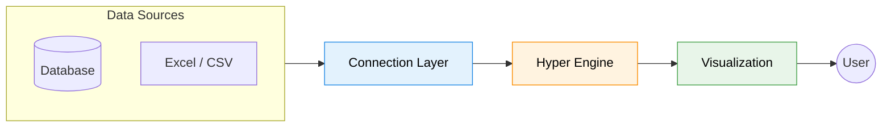
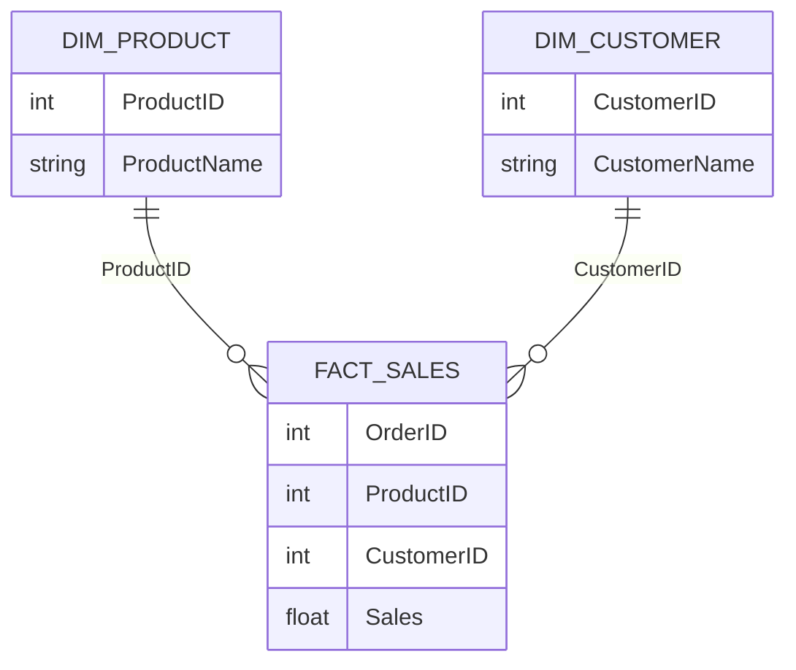

# **Context**

- [**Context**](#context)
- [**Day 60 - Tableau**](#day-60---tableau)
  - [**Why Tableau? Why not Excel or Power BI?**](#why-tableau-why-not-excel-or-power-bi)
  - [**Power BI vs Tableau**](#power-bi-vs-tableau)
  - [**Tableau Architecture**](#tableau-architecture)
  - [**What is ETL in Tableau?**](#what-is-etl-in-tableau)
  - [**Relationships in Tableau**](#relationships-in-tableau)
  - [**Drill Down vs Drill Up (Hierarchy)**](#drill-down-vs-drill-up-hierarchy)
    - [**Drill Down**](#drill-down)
    - [**Drill Up**](#drill-up)
    - [**Hierarchy in Tableau**](#hierarchy-in-tableau)
  - [**Data Model Types in Tableau**](#data-model-types-in-tableau)
    - [1. Relationships (Logical Layer)](#1-relationships-logical-layer)
    - [2. Joins (Physical Layer)](#2-joins-physical-layer)
    - [3. Union](#3-union)
  - [**For Data Modeling**](#for-data-modeling)
- [**Tableau Part 02**](#tableau-part-02)
  - [**1. Worksheet (Visual)**](#1-worksheet-visual)
  - [**2. Filters \& Quick Filters**](#2-filters--quick-filters)
  - [**3. Dashboard**](#3-dashboard)
  - [**4. Navigation \& Actions**](#4-navigation--actions)
  - [**5. Maps in Tableau**](#5-maps-in-tableau)
- [**Tableau Part 03**](#tableau-part-03)
  - [**1. Drill Through (Dashboard Actions)**](#1-drill-through-dashboard-actions)
  - [**2. Date \& Fiscal Calendar**](#2-date--fiscal-calendar)
  - [**3. Calculated Fields**](#3-calculated-fields)
  - [**4. Tableau Key Concepts**](#4-tableau-key-concepts)

---

# **Day 60 - Tableau**

- Tableau is a **visual analytics / business intelligence platform** used to see, understand, and act on data. Tableau Desktop lets you connect to data and build analyses and dashboards on **Mac or PC**; Tableau Cloud is the hosted version; Tableau Public is a **free** platform for public data sharing.

---
[⬆️ Go to Context](#context)

## **Why Tableau? Why not Excel or Power BI?**

- It is popular for **data exploration, dashboard building, and visual storytelling**. Its desktop product emphasizes flexible self-service analytics, and its cloud product lets teams share insights securely without managing servers.

1. **Visualization First Approach**

   - Tableau is built **specifically for data visualization**
   - Drag-and-drop interface makes it faster than Excel
   - More flexible visual design compared to Power BI

2. **Ease of Use**

    - No heavy coding required
    - Business users can quickly build dashboards

3. **Live Data Connectivity**

   - Connects to databases (MySQL, PostgreSQL, APIs)
   - Supports **live queries** and **extract mode**

4. **Fast Performance**

   - Uses **Hyper Engine** for in-memory processing
   - Handles large datasets efficiently

5. **Advanced Analytics**

   - Built-in forecasting, clustering, trend lines
   - Supports calculated fields (similar to DAX but simpler)

6. **Interactive Dashboards**

   - Highly customizable dashboards
   - Better control over layout and design than Power BI

---
[⬆️ Go to Context](#context)

## **Power BI vs Tableau**

| Feature       | Tableau                                   | Power BI                                       |
| ------------- | ----------------------------------------- | ---------------------------------------------- |
| Company       | Salesforce                                | Microsoft                                      |
| Main Focus    | Advanced data visualization & exploration | Business analytics & reporting                 |
| Ease of Use   | Slightly harder to learn                  | Easier for beginners                           |
| UI Experience | More flexible & design-focused            | Simple, similar to Excel                       |
| Data Handling | Strong with large & complex data          | Good, but slightly less powerful for huge data |
| Integration   | Works with many sources                   | Best with Microsoft ecosystem (Excel, Azure)   |
| Cost          | Expensive                                 | Free version available, cheaper overall        |
| Performance   | Fast for visualization                    | Fast, optimized for MS tools                   |
| Customization | Highly customizable dashboards            | Moderate customization                         |
| Sharing       | Tableau Server / Cloud                    | Power BI Service (cloud-based)                 |
| Best For      | Data analysts, advanced visualization     | Business users, quick reporting                |

---
[⬆️ Go to Context](#context)

## **Tableau Architecture**



- **Connection Layer:** Connects to live or extract data
- **Hyper Engine:** Processes and stores data efficiently
- **Visualization Layer:** Where dashboards are created
- **User:** Interacts with reports

---
[⬆️ Go to Context](#context)

## **What is ETL in Tableau?**

Tableau is mainly **ELT (Extract → Load → Transform)**

1. **Extract**

   - Connect to data sources (Excel, SQL, APIs)

2. **Load**

   - Data is loaded into Tableau (Live or Extract)

3. **Transform**

   - Done using:

     - Data Source tab
     - Calculated fields
     - Tableau Prep (for heavy cleaning)

---
[⬆️ Go to Context](#context)

## **Relationships in Tableau**

- Similar to Power BI but handled differently



- Tableau uses **logical relationships instead of strict joins**
- Relationships are resolved **at query time**

---
[⬆️ Go to Context](#context)

## **Drill Down vs Drill Up (Hierarchy)**

### **Drill Down**

- Go from **summary → detail**

Example:

- Year → Quarter → Month → Day

---

### **Drill Up**

- Go from **detail → summary**

---

### **Hierarchy in Tableau**

- You manually create hierarchies:

  - Right-click → Create Hierarchy
- Used in:

  - Date fields
  - Location data

---
[⬆️ Go to Context](#context)

## **Data Model Types in Tableau**

### 1. Relationships (Logical Layer)

- Tables remain separate
- Combined dynamically during visualization

---

### 2. Joins (Physical Layer)

- Tables merged physically

Types:

- Inner Join
- Left Join
- Right Join
- Full Join

---

### 3. Union

- Combines rows from multiple tables

---
[⬆️ Go to Context](#context)

## **For Data Modeling**

Best practice:

```xlsx
Dimension Table (1)
        ↓
Fact Table (*)
```

- Tableau also prefers **Star Schema**
- Avoid too many joins → performance issue

---

# **Tableau Part 02**

## **1. Worksheet (Visual)**

- Equivalent to Power BI visual

- **Key Features**

  - Drag fields to Rows / Columns
  - Marks card controls:

  - Color
  - Size
  - Label
  - Automatic chart suggestions (Show Me)

- **When to use**

  - For building individual charts

---
[⬆️ Go to Context](#context)

## **2. Filters & Quick Filters**

- Used to filter data

- **Types**

  - Extract Filters
  - Data Source Filters
  - Context Filters
  - Dimension & Measure Filters

- **Quick Filters**

  - UI filter shown to users
  - Dropdown / slider / list

---
[⬆️ Go to Context](#context)

## **3. Dashboard**

- Combines multiple worksheets

- **Key Features**

  - Drag-and-drop layout
  - Responsive design
  - Add images, text, web objects

- **When to use**

  - Combine multiple insights in one view

---
[⬆️ Go to Context](#context)

## **4. Navigation & Actions**

- Tableau uses **Actions instead of bookmarks**

Types:

- Filter Action

- Highlight Action

- URL Action

- **When to use**

  - Create interactive dashboards
  - Link charts together

---
[⬆️ Go to Context](#context)

## **5. Maps in Tableau**

- Built-in geographic support

- **Key Features**

  - Auto-detect country, city
  - Latitude & Longitude support
  - Filled maps & symbol maps

- **When to use**

  - Location-based analysis

---

# **Tableau Part 03**

## **1. Drill Through (Dashboard Actions)**

- Done using **Filter Actions**

- **How it works**

  - Click a chart → filters another chart/dashboard

- **Example**

  - Click Region → show detailed sales

---
[⬆️ Go to Context](#context)

## **2. Date & Fiscal Calendar**

- Tableau supports fiscal year setup

- **How**

  - Right-click date field → Default Properties
  - Set Fiscal Year Start

- Supports:

  - Year, Quarter, Month hierarchy
  - Custom date formats

---
[⬆️ Go to Context](#context)

## **3. Calculated Fields**

- Equivalent to DAX (but simpler)

---

- **Basic Functions**

  - `SUM([Sales])`
  - `AVG([Profit])`
  - `MIN() / MAX()`

---

- **Logical**

  - `IF [Sales] > 10000 THEN "High" ELSE "Low" END`

---

- **Level of Detail (LOD)**

  - Most powerful feature

  - Example:

    ```xlsx
    FIXED [Region]: SUM([Sales])
    ```

---

- **Table Calculations**

  - Running total
  - Rank
  - Percent difference

---
[⬆️ Go to Context](#context)

## **4. Tableau Key Concepts**

- **Dimension vs Measure**

  - Dimension → categorical (Name, Region)
  - Measure → numeric (Sales, Profit)

---

- **Discrete vs Continuous**

  - Discrete → Blue (categories)
  - Continuous → Green (ranges)

---

- **Aggregation**

  - SUM, AVG, COUNT automatically applied

---

- **Context Filters**

  - Filters applied before others
  - Improves performance

---

- **Order of Operations**

  - Tableau has a strict execution order:

  - Extract Filters
  - Data Source Filters
  - Context Filters
  - Dimension Filters
  - Measure Filters

---
[⬆️ Go to Context](#context)
